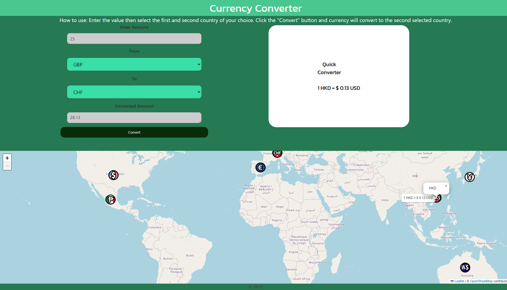

# Currency Converter

## Description

This is an application that allows the user to enter a dollar amount convert from one currency to another. The user can also click on the map and see the conversion rate from 1 countries' currency to USD. The last searched currency searched on the map is stored. This application was made with HTML, CSS, and JavaScript.

## Installation

N/A

## Usage

1. Enter dollar amount
2. Choose a "From" currency from the drop down
3. Choose a "To" currency from the drop down
4. Click "Convert"
5. Pick a country tag and see the conversion to USD

## Screenshot

## Link to Deployment

https://github.com/MegMathis/Currency_Converter

https://megmathis.github.io/Currency_Converter/

## Credits

https://api.api-ninjas.com/v1/convertcurrency
https://leafletjs.com/reference.html

## License

MIT License
